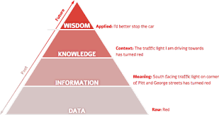

# pojęcia wstępne

- **obecnosc obowiazkowa**
- punkty za aktywnosc

# agenda

- MODEL: data information knowledge wisdom (DIKW)
- 

## teoria shannona

- dotyczy zagadnien transmisji sygnalu przez kanal informacyjny, z uwzglednieniem szumu

## teoria infologiczna langeforsa

- dane to nie informacja
- informacja powstaje w umysle czlowieka jako proces interpretacji dnaych

```
I = i(D,S,t)
I - informacja
i - proces interpretacji 
D - dane 
S - przedwiedza 
t - czas
```

- informacja ma charakter subiektywny

## wybrane definicje dane - informacje

- dane reprezentuja nieustruktyrzowane fakty
- informacja ma znaczenie
- Dane: fakty zgromdzone z obserwacji lub zapiskow dotyczacych zjawisk, obiektow lub ludzi (`Galland 1982`)
- Dane:
  - Jezyk naturalny: podane fakty z ktorych inni moga dedukowac
  - informatyka: znaki lub symbole w szczegolnosci w transkmisji w systemach komunikacji
