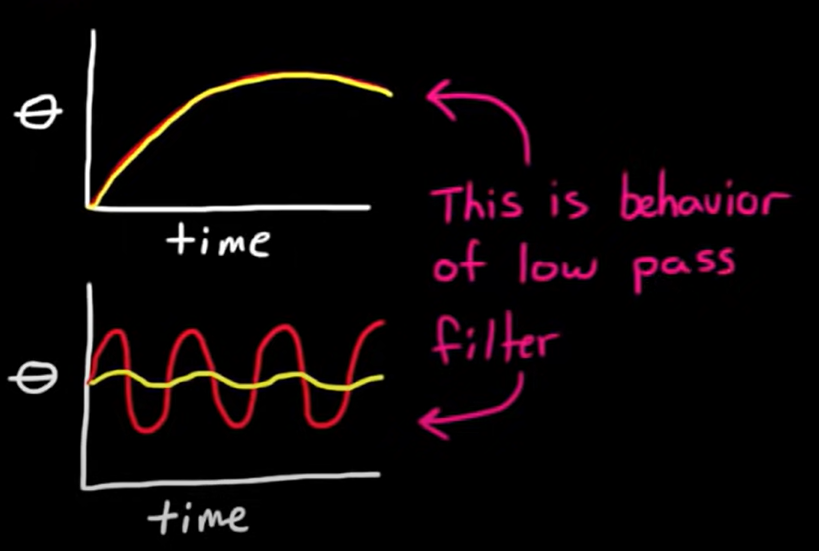

# car example
- `y` - velocity
- `u` - angle of gas pedal
- `f` - transfer function (low pass filter)
  - higher frequency of change in `u` results in smaller change in `y`
  - 
$$ y = f(u) = \frac{1}{\frac{S}{\mathcal{w_0}} + 1} $$ 
```plantuml
u ..>"transfer function f" y
```