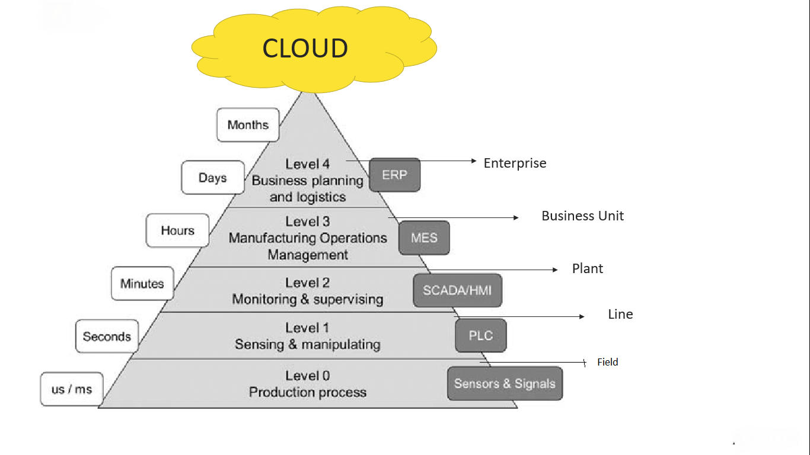
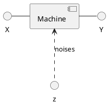

## [table of content](../readme.md)

# pojecia organizacyjne

- jest przepis przy dobrych ocenach z projektu i labów
- egzamin 07 II 2023 11:15 - 13
- poprawkowy 14 II 2023

# pojecia wstepne

## automation hierarchy

1. `erp` - zlecenie produckji
2. `mrp/mrp2` zapewnienie dostaw, zasobow, osob, czasow maszyn
2. `mes` - monitorowanie przebiegu produkcji - inf o opoznieniach, stanie produkcji. Zbiera i przetwarza dane  
3. `scada` - sterowanie nadrzedne
4. `PLC` - logic controler sterowanie bezposrednie
5. `field level` - proces przemyslowy - obrobka chemiczna, cieplna itp.

