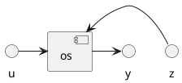

# stabilizacja

## struktury systemow sterowania



- os - obiekt sterowania
- us - urzadzenie sterujace
- z - zaklocenia
- y - wyjscie obiektu

1. algorytm sterowania w drodze projektowania

 -  ```plantuml
     @startuml
     w -> [us]
     [us] -> u
     ```
 - w wielkosci mierzalne
 - u wielkosci sterujace

## system stabilizacji
- zadanie stablizacji
  - struktura zamknieta
  - celem sterowania jest doprowadzenie y(t) do wartosci zadanej y* i utrzymanie jej w czasie
##### todo wziac wzor od ali
- $y(t) -> y*$ (stabilizacja)   
- $y(t) -> y*(t)$ (regularyzacja/ sterowanie nadążne)
  - sterowanie nadążne - y* pojawia sie na biezaco np rakieta leci za ruchomym celem
- struktura stabilizacji
##### to do wzor od ali

## przykladowe obiekty stabilizacji  
1. regulacja temperatury w pomieszczeniu
     - `y` - temperatura wewnetrzna w pomieszczeniu
     - `z` - zaklocenia       
         - temperatura na zewnatrz
         - zmienne parametry przegrody (scian okien, drzwi)
         - liczba osob, urzadzen w pomieszczeniu
     - `u` - wartosc strujaca. Okreslamy `u(t)` ogrzewanie /chlodzenia
    - `us` - urzadzenie rykonawcze - wlacza grzalke/ klimatyzator
    - `os` - pomieszczenie
2. pacjent OIOM
     - `y` - cisnienie, puls, tetno, saturacja 
     - `z` - zaklocenia       
         - temperatura otocznia
         - inne czynniki (destrukcyjne, chorobo-tworcze)
     - `u` - wartosc sterujaca - oddzialywanie:
       - chemizne
       - mechaniczne
       - biologiczne
3. student
     - `y` - wiedza, umiejetnasci, kompetencje
     - `z` - zaklocenia       
         - piwo
         - **baba**
         - imprezy
         - bojowe zadanie starego
  
     - `u`
        - narzedzia dydaktyczne; wyklad, laborki, cwiczenia. Rozwiywanie zadan

### model matematyczny do (1.)
- d, c - stala proporcjonalna
- $\dot{y}$ - pochodna z y
- ~ - znak proporcjonalnosci
- $T_w = y$ - temp wewnetrzna
- $T_z = y$ - temp zewnetrzna (przyjmijmy ze to jedyne zaklocenia)
- $P_g = u$ - moc grzalki 
- $T_w$ ~ $P_g$ 
- $\dot{ T_w}$ ~ $(T_z - T_w)$
 $$ cT_w = P_g + d(T_z - T_w)'$$
 $$c\dot{y} =u + d(z - y)$$
 $$c\dot{y} + dy =u + dz $$

## typowe algorytmy stabilizacji1. sterowanie dwupolozeniowe
- urzywanie pojedynczo  algorytmow (1 - 4) nie ma sensu
- $\mathcal{E}$ - y*(t) - y(t)
- $\tau$ - zmienna calkowania - zmienna lokalna
- $k_p$ - wspolczynnik proporcjonalnosci (>0)
   - np. $k_p = 1/2$ na kazdy stopien celcjusza podaj pol tabletki 
1. dwupolozeniowe
$$ u(t) =     \begin{cases}
      U &  \mathcal{E}(t) > 0\\
      0 &  \text{w przeciwnym przypadku}\\
    \end{cases}    $$ 
2. sterowanie proporcjonalne
   $$ u(t) = k_p * \mathcal{E}(t) $$
3. sterowanie calkujace
$$u(t) =  \int_{0}^{t} \mathcal{E}(\tau)d\tau$$
4. sterowanie rozniczkujace  
$$k(t)  = k_d* \mathcal{E}(t) $$
5. PID - sterowanie proporcjonalno calkujaco rozniczkujace
   $$u(t) = k_p * \mathcal{E}(t) +  \int_{0}^{t} \mathcal{E}(\tau)d\tau +  k_d* \mathcal{E}(t) $$ 
   rozniczkujemy zeby pozbyc sie calki
   $$u(t) = k_p * \hat{\mathcal{E}(t)} +  k_i* \mathcal{E}(t) + k_d*\hat{\hat{\mathcal{E}(t)}}$$