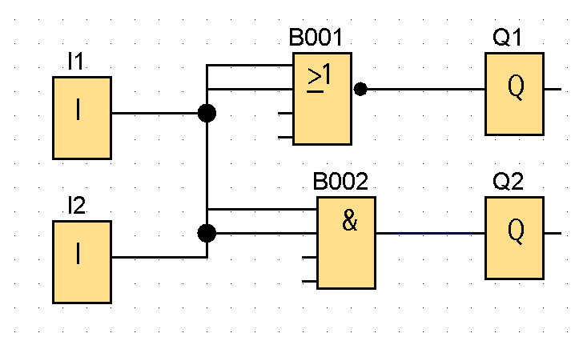

## PIP labolatoria projekt 1 Michał Skibiński

### Zadanie

Zaprojektować system sterowania temperaturą w pomieszczeniu
w którym znajdują się 2 czujniki temperatury, grzejnik i klimatyzator

### wejście

| zmienna | urządzenie          | opis                          |
| ------- | ------------------- | ----------------------------- |
| i1      | czujnik temperatury | 1 gdy temperatura > 20 stopni |
| i2      | czujnik temperatury | 1 gdy temperatura > 25 stopni |

### wyjście

| zmienna | urządzenie   | opis                          |
| ------- | ------------ | ----------------------------- |
| q1      | grzejnik     | 1 gdy temperatura < 20 stopni |
| q2      | klimatyzator | 1 gdy temperatura > 25 stopni |

### sterowanie

| stan           | zdarzenie                | akcja         |
| -------------- | ------------------------ | ------------- |
| i1 = 0, i2 = 0 | grzejnik załącza się     | q1 = 1 q2 = 0 |
| i1 = 1, i2 = 0 | grzejnik wyłącza się     | q1 = 0 q2 = 0 |
| i1 = 1, i2 = 1 | klimatyzator załącza się | q1 = 0 q2 = 1 |
| i1 = 1, i2 = 0 | klimatyzator wyłącza się | q1 = 0 q2 = 0 |

### tabelka prawdy

| i1  | i2  | q1  | q2  |
| --- | --- | --- | --- |
| 0   | 0   | 1   | 0   |
| 1   | 0   | 0   | 0   |
| 1   | 1   | 0   | 1   |
| 1   | 0   | 0   | 0   |

### funkcje logiczne

$$ q1 = \neg i*{1} \wedge \neg i*{2} $$
 $$ q2 = i_{1} \wedge i_{2}$$

## bramki logiczne

