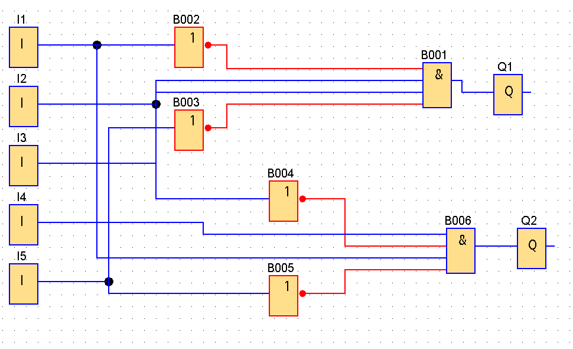

# Projekt 2
### Michał Skibiński, Paweł Lachawiec, Adam Bednarski
## zadanie
Problemem do rozwiązania jest problem obsługi bramy wjazdowej na posesję. Brama ma otwierać się automatycznie, kiedy auto najedzie na przycisk przed bramą, oraz zamknąć się, gdy auto z niego zjedzie. Oprócz tego brama jest wyposażona w czujnik ruchu, który ma zapobiec przygnieceniu jakiegoś obiektu.
### wejscie

| zmienna | urządzenie    | opis                         |
| ------- | ------------- | ---------------------------- |
| i1      | czujnik ruchu | 1 gdy brama jest zamknieta   |
| i2      | czujnik ruchu | 1 gdy brama jest otwarta     |
| i3      | przycisk      | 1 gdy brama ma sie zamknac   |
| i4      | przycisk      | 1 gdy brama ma sie otworzyc  |
| i5      | przycisk      | 1 gdy brama ma sie zatrzymac |

# wyjscie

| zmienna | urządzenie | opis                  |
| ------- | ---------- | --------------------- |
| q1      | silnik     | 1 zeby zamknac brame  |
| q2      | silnik     | 1 zeby otworzyc brame |

# funkcje logiczne

$$ q_1 = \neg i_{1} \wedge i_{2} \wedge i_{3}\wedge \neg i_{5} $$
$$ q2 = i_{1} \wedge \neg i_{2} \wedge i_{4}\wedge \neg i_{5} $$

# diagram stanów
