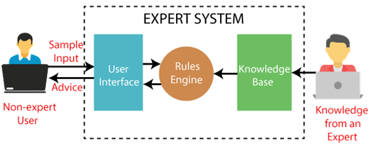
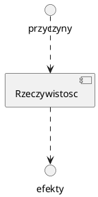

## [table of content](../readme.md)

# pojecia wstepne

- egzamin 03 I 2023
- drugi termin 10 I 2023

# wprowadzenie

## idea sztucznej inteligencji

- AI - program badawczy dedykowany analizie projektowaniu i realizacji systemow inteligentnych
- AI modele algorytmy i narzedzia sluzace do formulowania i rozwiazywania problemow **wymagajacych wiedzy i inteligencji**

## kierunki rozwoju

- nurt miękki - ukierunkowany na rozwoj opisow rzeczywistosci, postrzeganie, zapamietywanie itp.
- nurt sprzetowy - "ślepe" nasladowanie rzeczywistosci

## problemy sztucznej inteligencji

1. Reprezentowanie (modelowanie) wiedzy i wnioskowanie
   1. rachunek zdan logicznych
   2. rachunek predykatow - trudnosci zwiazane z automatyzacja wnioskowania
   3. Inzynieria wiedzy _systemy ekspertowe_ np. _DENDRAL_
   4. automatyczne dowodzenie twierdzen. Np na podstawie zasady aksjomatow
2. Reprezentowanie i przetwazanie wiedzy niepewnej "subiektywnej"
   1. Opis probabilistyczny
   2. logiki modalne np. temporalna (wnioskowanie w czasie: zawsze, nigdy itp)
   3. logiki wielowartosciowe
   4. logika rozmyta
3. Uczenie sie
   1. Systemy uczące sie (uczenie ze wzmocnieniem itp)
4. Sztuczne sieci neuronowe
   1. model neuronu (model poczatkowo zostal opisany za pomoca rownan rożniczkowych, potem za pomoca rownan algebraicznych)
   2. uczenie neuronu
   3. zlozone zroznicowanie funkcjonalne struktury **sieci glebokie**
5. Metaheurystkyki inspirowane przyroda
   1. algorytmy genetyczne
   2. algorytmy ewolucyjne
   3. algorrytm mrowkowy
   4. algorytmy rojowe
   5. symulowane wyrzarzanie

## wybrane zastosowania

1. problemy eksploracji danych
1. sterowanie rozmyte, wspomaganie decyjzi
1. systemy agentowe
1. sieci neuronowe, klasyfikacja rozpoznawanie obrazow
1. sterowanie, wspomaganie decyzji

# Systemy ekspertowe z logiczna reprezentacja wiedzy

## pojecia

- Dane: Data
- Informacja: "radiowoz nr 20 jedzie z ulica 15 z predkoscia 120 km/h"
- Wiedza: "radiowoz jest w akcji poscigowej"
- Inzynieria - operacje dzialania ktore mozna na danej dziedzinie wykonywac

### operacje na wiedzy

- pozyskiwanie
- reprezentowanie
- przetwazanie - algorytmy wnioskowania
- walidacja i aktualizacja

## system ekspertowy



- Baza wiedzy - implementacja reprezentacja wiedzy
- maszyna wnioskujaca - implementacja algorytmow wnioskowania

### podstawowe zadania ktore system ekspertowy moze wspomagac uzytkownika



- zadanie analizy - "jaki moze byc skutek okreslonego dzialania"
- zadanie diagnostyki - "jakie moga byc przyczyny danego efektu"
- zadanie podejmowania decyzji - "jakie dzialanie zapewni pozadany skutek"

## reprezentowanie wiedzy za pomooca formol logicznych

- **zdanie logiczne** - stwierdzenie ktoremu mozna przypisac wartosc logiczna
- formula logidzna reprezentuje zdanie logiczne
- formuly reprezentujace zdanie

```
p - okno jest otwarte
q - drzwi sa zamkniete
r - pokoj jest zamkniety
w(p) = 1, w(q) = 1 oznaczaja ich wartosci logiczne na podstawie aktualnego stanu
```

### uwagi

1. Zastosowanie przeykatow - funkcje zdaniowe umozliwiwaja bardziej szczegolowy opic niz _formuly logiczne_
   - np. - P(N) Okno N jest otwarte - P(T) Okno jest otwarte w chwili T - P(N, T) Okno N jest otwarte w chwili T
   - Tak wiec: zamiast czas pieczenia jest rowny 40 min, mozemy uzyc czas pieczenia jest rowny T (zmienna)
2. Stosowanie predykatow uniemozliwia wykorzystanie uniwesalnych algorytmow przetwarzania wiedzy (wnioskowania):

### UWAGI

1. do forumulowania i rozwiazywania zadan wspomagania uzytkownika systemu ekspertowego trzeba wyroznic elementarne wlasnosci (forrmuly) traktowane jako "przyczyny", "dzialania" oraz "efekty/skutku"
2. formuly elementarne stanowia "klocki" z ktorych mozemy budowac opis
