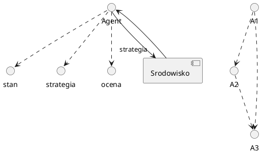

## [table of content](../readme.md)

# grafy

## czym jest graf

### wierzcholki

V = $(V_i)_{i = 1}^N$

### krawedzie

E = ${v_i, v_j}$ takich ze $v_i$ jest polaczone z $v_j$

### graf

G = (V,E)

### pojecia

1. droga - ciag koejnych sasiadujacych wierzcholkow bez cykli
2. sciezak - droga ale wierzcholki nie moga sie powtarzac
3. Cykl - droga o tym samym poczatku i koncu

## grafy

1. proste
2. skierowane
3. multigraf - krawedzie wielokrotne i petle
4. graf dwudzielny - istnieja powiazania miedyz wierzcholkami z 2 grup np seic dostawcow i odbiorcow, uzytkownicy i filmy jakie obejrzeli.
5. graf pelny
6. graf przypadkowy losowe generowanie krawedzi

## siec zlozona

- Rzad / stopien = $|E| = N(N - 1)/2$
- rozmiar = $|E|$
- gestosc = $2|E|/N(N -1)$ - stosunek krawedzi do wszystkich mozliwych krawedzi
- srednica = najdluzsza sciezka w grafie
- srednia dlugosc sciezki = gdy mala to graf zwarty, latwo przechodza informacje, gdy duza to graf rozproszony, trudno przechodza informacje

## wiercholki

- miary centralnosci = liczba krawedzi ktore wchodza i wychodza z wierzcholka
  (np influencer jest wierzcholkiem o duzej centralnosci)
- stopien wierzcholka = liczba krawedzi ktore wchodza i wychodza z wierzcholka
- srednid stopien wezla = $<C_D> = 2|E|/N$
- bliskosc = odwrotnosc odleglosci od innych wierzcholkow
- posrednictwo = liczba / odsetek najkrotszych **drog** przechodzacych przez wierzcholek

### miary centralnosci

- posrednictwo = liczba najkrotszych sciezek przechodzacych przez wierzcholek
  - moze sie wydawac ze wierzcholek jest nie wazny ale jak usuniemy to lipton
- wezly transportowe = duzo scieżek przez nie przechodzi
  -miara znaczenia wezla dla odpornosci sieci na uszkodzenia - ile drog tracimy usuwajac wezel. **nie musi miec wysokiej wartosci miary centralnosci**
- waga = bliskosc miedzy wierzcholkami krawedzi **nie dzila do grafow wazonych**
- centralnosc wektora wlasnego (algorytm PageRank)

### podgrafy

- spojne skladowe grafu
- k-spojnosc wierzcholkowa/krawedziowa
  - ile minimalnie trzeba usunac wierzcholkow zeby rozzpojnic graf
  - mosty - krawedzie ktore rozspojniaja graf
- klika n-tego rzedu = podgraf pelny o n wierzcholkac

# siec

- stan wezla
- dynamiczna zmiana stanu - wierzcholkow, krawedzi
- rozklad stopni wezlow
  - rozklad potegowy
  - huby
  - efekt malych swiatow

